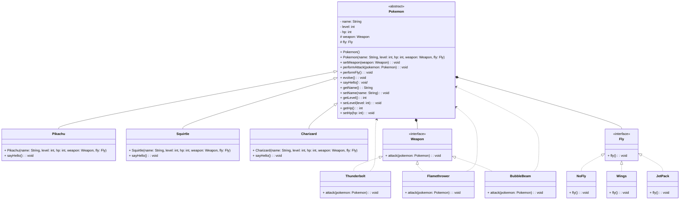

```mermaid
classDiagram
    Pokemon <|-- Pikachu
    Pokemon <|-- Squirtle
    Pokemon <|-- Charizard
    Pokemon *-- Weapon
    Pokemon *-- Fly
    Fly <|.. NoFly
    Fly <|.. Wings
    Fly <|.. JetPack
    Weapon <|.. Thunderbolt
    Weapon <|.. Flamethrower
    Weapon <|.. BubbleBeam
    Pokemon <.. Thunderbolt
    Pokemon <.. Flamethrower
    Pokemon <.. BubbleBeam
  class Pokemon {
      <<abstract>>
    - name: String
    - level: int
    - hp: int
    # weapon: Weapon
    # fly: Fly
    + Pokemon()
    + Pokemon(name: String, level: int, hp: int, weapon: Weapon, fly: Fly)
    + setWeapon(weapon: Weapon): void
    + performAttack(pokemon: Pokemon): void
    + performFly(): void
    + evolve(): void
    + sayHello()* void
    + getName(): String
    + setName(name: String): void
    + getLevel(): int
    + setLevel(level: int): void
    + getHp(): int
    + setHp(hp: int): void
  }

  class Fly {
      <<interface>>
    + fly(): void
  }

  class Weapon {
      <<interface>>
    + attack(pokemon: Pokemon): void
  }

  class Pikachu {
    + Pikachu(name: String, level: int, hp: int, weapon: Weapon, fly: Fly)
    + sayHello(): void
  }

  class Squirtle {
    + Squirtle(name: String, level: int, hp: int, weapon: Weapon, fly: Fly)
    + sayHello(): void
  }

  class Charizard {
    + Charizard(name: String, level: int, hp: int, weapon: Weapon, fly: Fly)
    + sayHello(): void
  }

  class NoFly {
    + fly(): void
  }

  class Wings {
    + fly(): void
  }

  class JetPack {
    + fly(): void
  }

  class Thunderbolt {
    + attack(pokemon: Pokemon): void
  }

  class Flamethrower {
    + attack(pokemon: Pokemon): void
  }

  class BubbleBeam {
    + attack(pokemon: Pokemon): void
  }
```