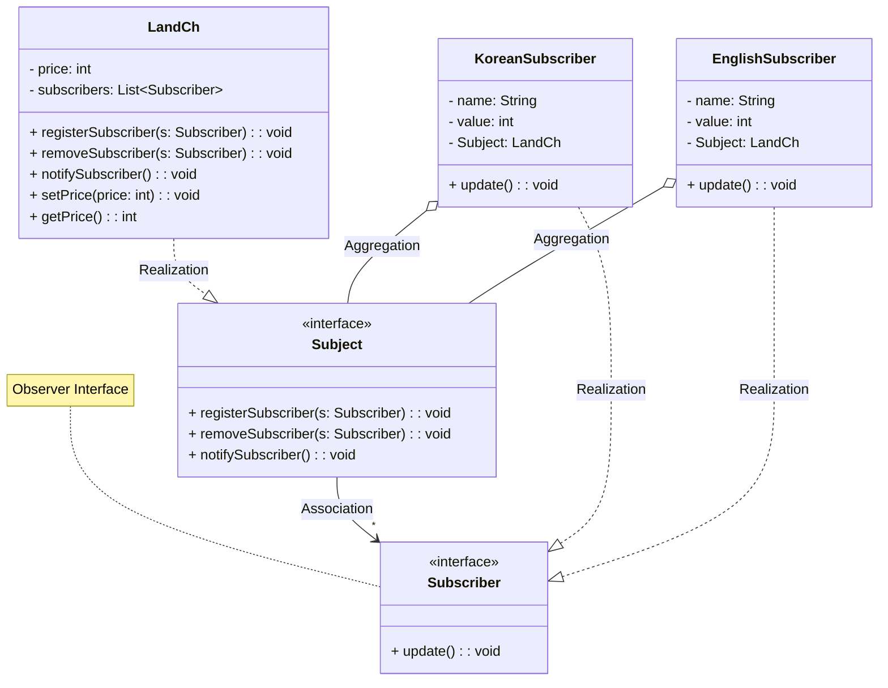

```mermaid
classDiagram
    Subject --> "*" Subscriber : Association
    LandCh ..|> Subject : Realization
    KoreanSubscriber ..|> Subscriber : Realization
    KoreanSubscriber o-- Subject : Aggregation
    EnglishSubscriber ..|> Subscriber : Realization
    EnglishSubscriber o-- Subject : Aggregation
    
    class Subject {
        <<interface>>
        + registerSubscriber(s: Subscriber): void
        + removeSubscriber(s: Subscriber): void
        + notifySubscriber(): void
    }

    class Subscriber {
        <<interface>>
        + update(): void
    }
    note for Subscriber "Observer Interface"
    
    class LandCh {
        - price: int
        - subscribers: List~Subscriber~
        + registerSubscriber(s: Subscriber): void
        + removeSubscriber(s: Subscriber): void
        + notifySubscriber(): void
        + setPrice(price: int): void
        + getPrice(): int
    }
    
    class KoreanSubscriber {
        - name: String
        - value: int
        - Subject: LandCh
        + update(): void
    }
    
    class EnglishSubscriber {
        - name: String
        - value: int
        - Subject: LandCh
        + update(): void
    }
```