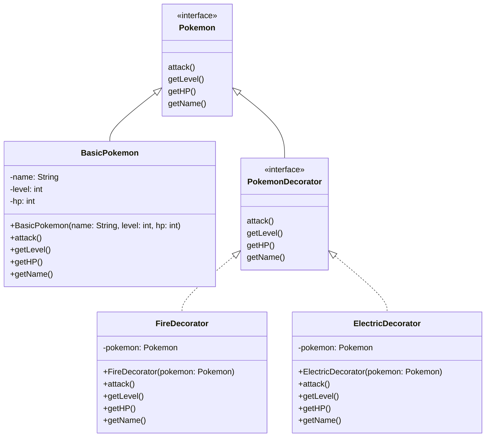

```mermaid
classDiagram
    class Pokemon {
        <<interface>>
        attack()
        getLevel()
        getHP()
        getName()
    }
    class BasicPokemon {
        -name: String
        -level: int
        -hp: int
        +BasicPokemon(name: String, level: int, hp: int)
        +attack()
        +getLevel()
        +getHP()
        +getName()
    }
    class PokemonDecorator {
        <<interface>>
        attack()
        getLevel()
        getHP()
        getName()
    }
    class FireDecorator {
        -pokemon: Pokemon
        +FireDecorator(pokemon: Pokemon)
        +attack()
        +getLevel()
        +getHP()
        +getName()
    }
    class ElectricDecorator {
        -pokemon: Pokemon
        +ElectricDecorator(pokemon: Pokemon)
        +attack()
        +getLevel()
        +getHP()
        +getName()
    }

    Pokemon <|-- BasicPokemon
    Pokemon <|-- PokemonDecorator
    PokemonDecorator <|.. FireDecorator
    PokemonDecorator <|.. ElectricDecorator

```