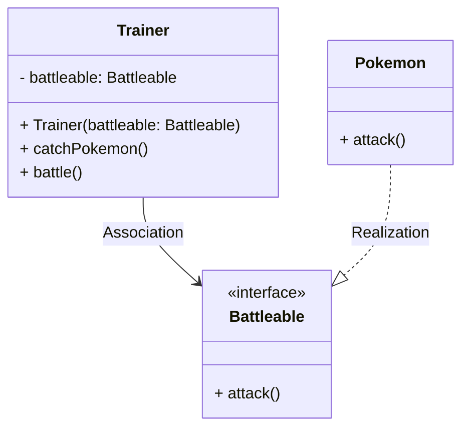

```mermaid
classDiagram
    Trainer --> Battleable : Association
    Pokemon ..|> Battleable : Realization
    class Battleable {
        <<interface>>
        + attack()
    }
    
    class Trainer {
        - battleable: Battleable
        + Trainer(battleable: Battleable)
        + catchPokemon()
        + battle()
    }
    
    class Pokemon {
        + attack()
    }
```
