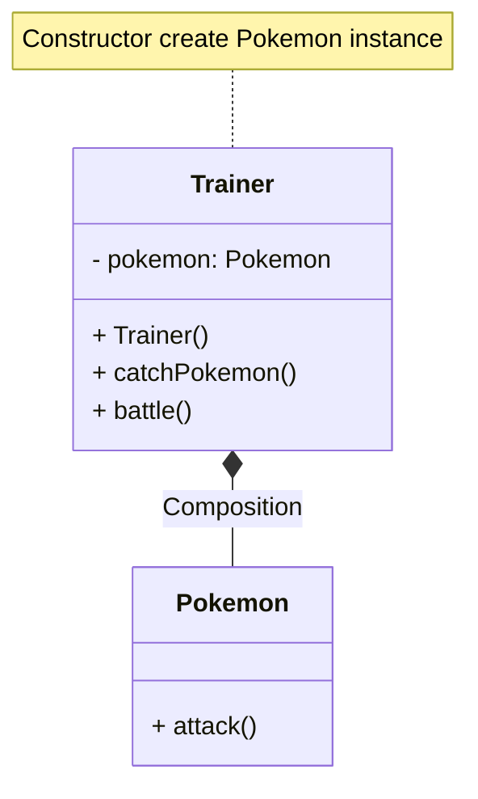

```mermaid
classDiagram
    Trainer *-- Pokemon : Composition
    
    note for Trainer "Constructor create Pokemon instance"
    class Trainer {
        - pokemon: Pokemon
        + Trainer()
        + catchPokemon()
        + battle()
    }
    
    class Pokemon {
        + attack()
    }
```
