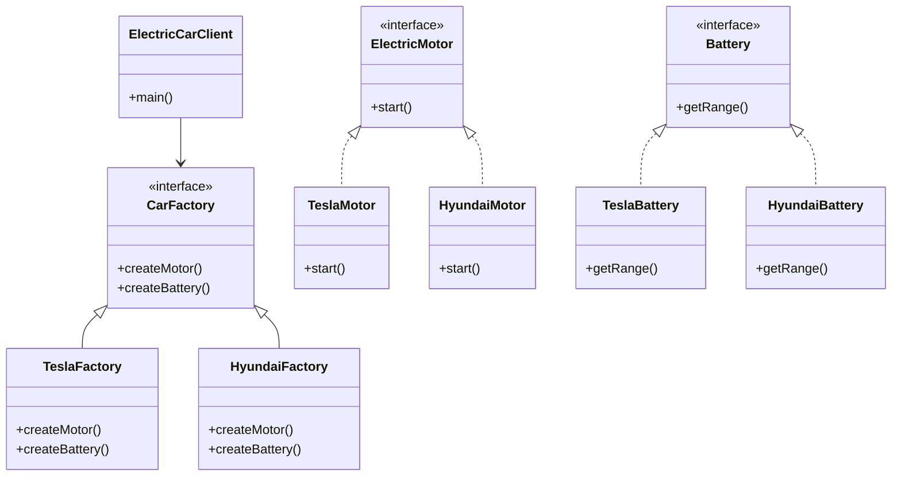

```mermaid
classDiagram

    CarFactory <|-- TeslaFactory
    CarFactory <|-- HyundaiFactory
    ElectricMotor <|.. TeslaMotor
    ElectricMotor <|.. HyundaiMotor
    Battery <|.. TeslaBattery
    Battery <|.. HyundaiBattery
    ElectricCarClient --> CarFactory
    
    class CarFactory {
        <<interface>>
        +createMotor()
        +createBattery()
    }
    class TeslaFactory {
        +createMotor()
        +createBattery()
    }
    class HyundaiFactory {
        +createMotor()
        +createBattery()
    }
    class ElectricMotor {
        <<interface>>
        +start()
    }
    class TeslaMotor {
        +start()
    }
    class HyundaiMotor {
        +start()
    }
    class Battery {
        <<interface>>
        +getRange()
    }
    class TeslaBattery {
        +getRange()
    }
    class HyundaiBattery {
        +getRange()
    }
    class ElectricCarClient {
        +main()
    }
```