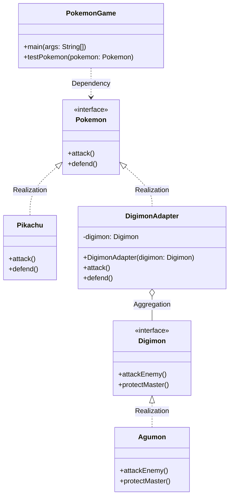

```mermaid
classDiagram
    Pokemon <|.. Pikachu : Realization
    Digimon <|.. Agumon : Realization
    Pokemon <|.. DigimonAdapter : Realization
    PokemonGame ..> Pokemon : Dependency
    DigimonAdapter o-- Digimon : Aggregation
    
    class Pokemon {
        <<interface>>
        +attack()
        +defend()
    }
    
    class Digimon {
        <<interface>>
        +attackEnemy()
        +protectMaster()
    }
    
    class Pikachu {
        +attack()
        +defend()
    }
    
    class Agumon {
        +attackEnemy()
        +protectMaster()
    }
    
    class DigimonAdapter {
        -digimon: Digimon
        +DigimonAdapter(digimon: Digimon)
        +attack()
        +defend()
    }
    
    class PokemonGame {
        +main(args: String[])
        +testPokemon(pokemon: Pokemon)
    }
```