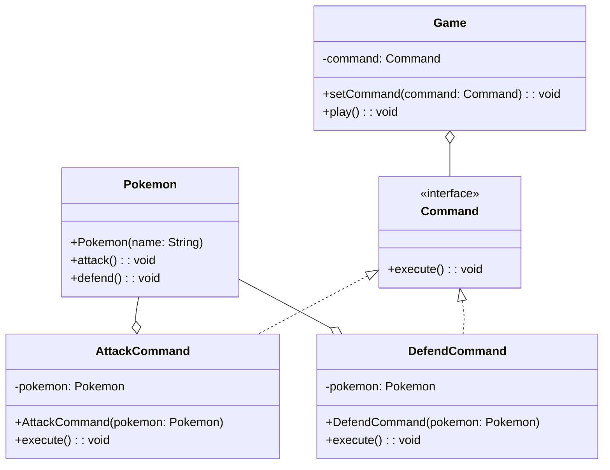

```mermaid
classDiagram
    Pokemon --o AttackCommand
    Pokemon --o DefendCommand
    Game o-- Command
%%    Game --> AttackCommand
%%    Game --> DefendCommand
    Command <|.. AttackCommand
    Command <|.. DefendCommand

    class Pokemon {
        +Pokemon(name: String)
        +attack(): void
        +defend(): void
    }

    class Command {
        <<interface>>
        +execute(): void
    }
    
    class AttackCommand {
        -pokemon: Pokemon
        +AttackCommand(pokemon: Pokemon)
        +execute(): void
    }
    
    class DefendCommand {
        -pokemon: Pokemon
        +DefendCommand(pokemon: Pokemon)
        +execute(): void
    }
    
    class Game {
        -command: Command
        +setCommand(command: Command): void
        +play(): void
    }
    
```