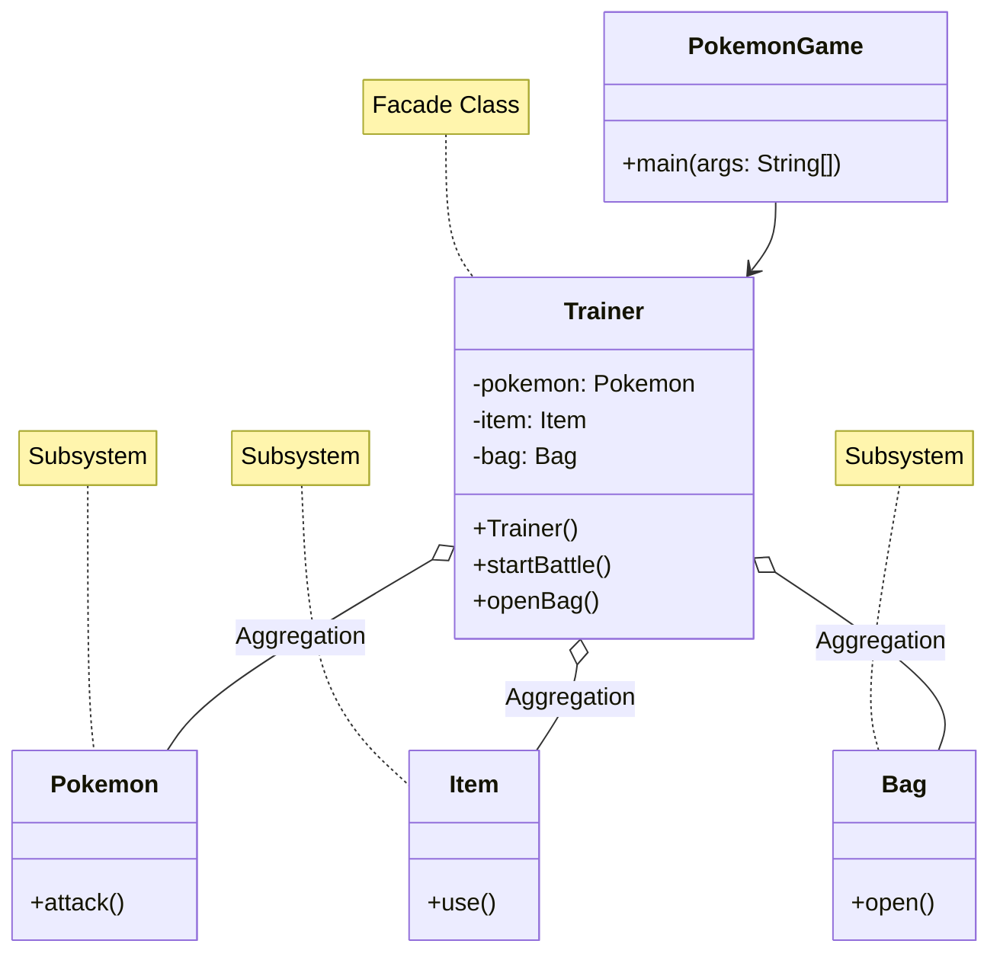

```mermaid
classDiagram
    PokemonGame --> Trainer
    note for Trainer "Facade Class"    
    
    Trainer o-- Pokemon : Aggregation
    Trainer o-- Item : Aggregation
    Trainer o-- Bag : Aggregation
    note for Pokemon "Subsystem"
    note for Item "Subsystem"
    note for Bag "Subsystem"
    
    class Pokemon {
        +attack()
    }

    class Item {
        +use()
    }

    class Bag {
        +open()
    }

    class Trainer {
        -pokemon: Pokemon
        -item: Item
        -bag: Bag
        +Trainer()
        +startBattle()
        +openBag()
    }

    class PokemonGame {
        +main(args: String[])
    }
```